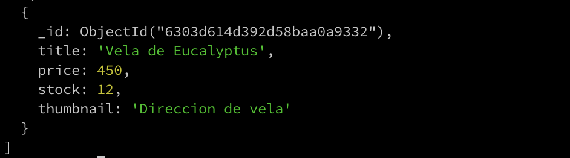
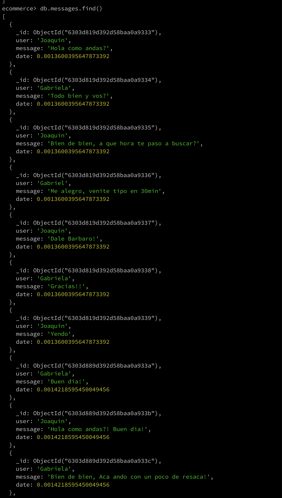
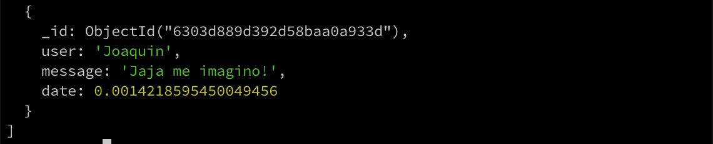
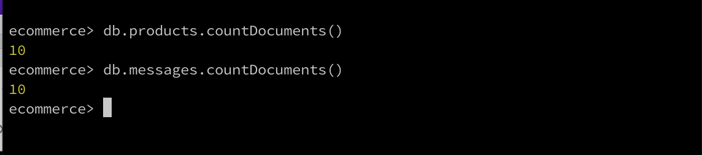
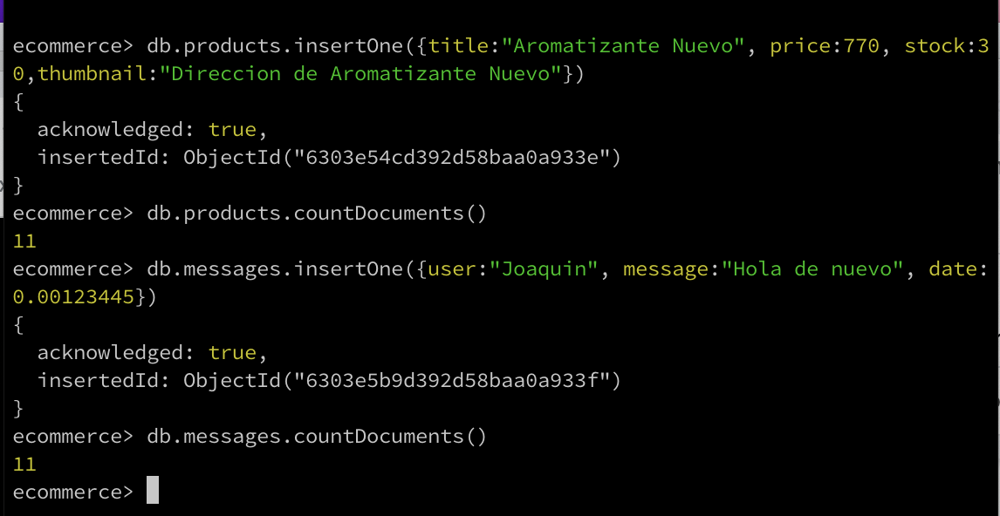
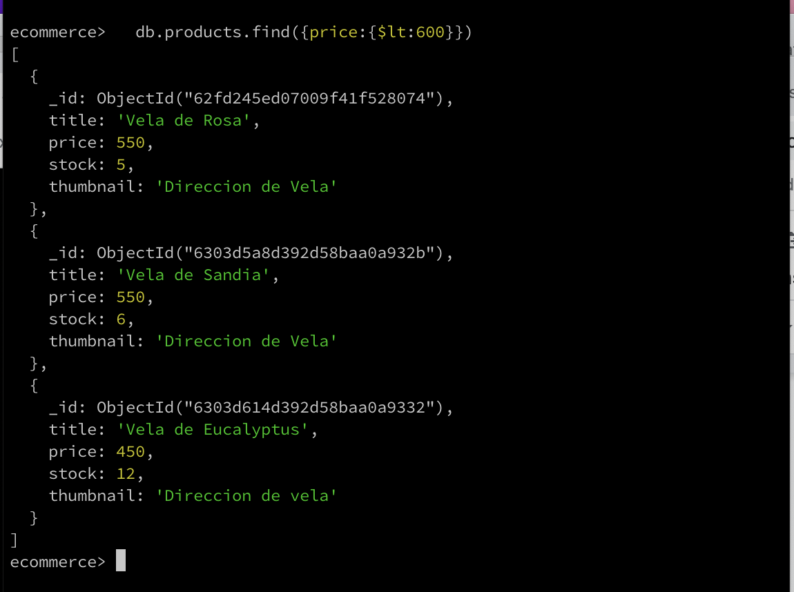
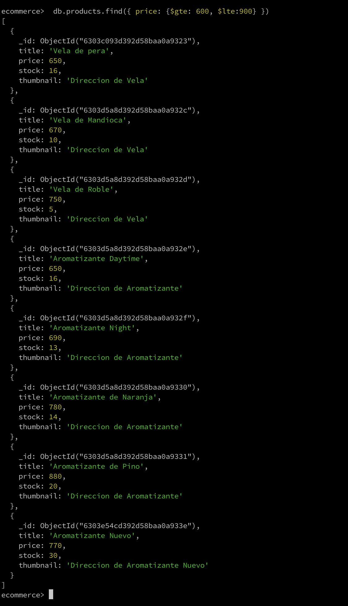
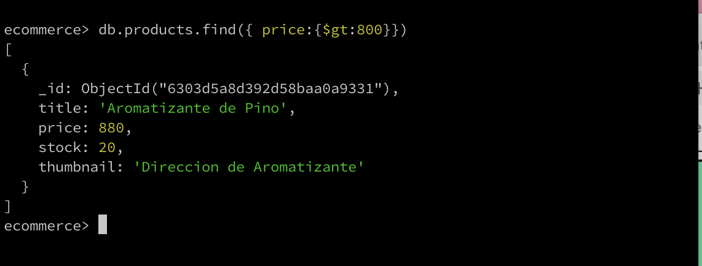
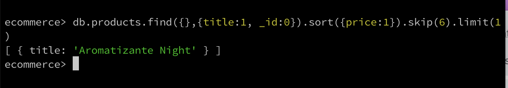

- Listar los documentos en cada coleccion:

  command: ecommerce> db.products.find()
  
  

  command: ecommerce> db.messages.find()
  
  

- Mostrar la cantidad de documentos almacenados en cada una de ellas:
  

CRUD

- Agregar un producto mas en cada coleccion:
  
- Listar los productos con precios menores a 600 pesos:
  
- Listar los productos con precios entre 600 y 900 pesos:
  
- Listar los Productos con precioes mayores a 800 pesos:
  
- Realizar una consulta que traiga solo el nombre del septimo producto mas barato:
  
- Hacer una actualizacion sobre todos los productos, agregando el campo stock a todos ellos con un valor de 100:
